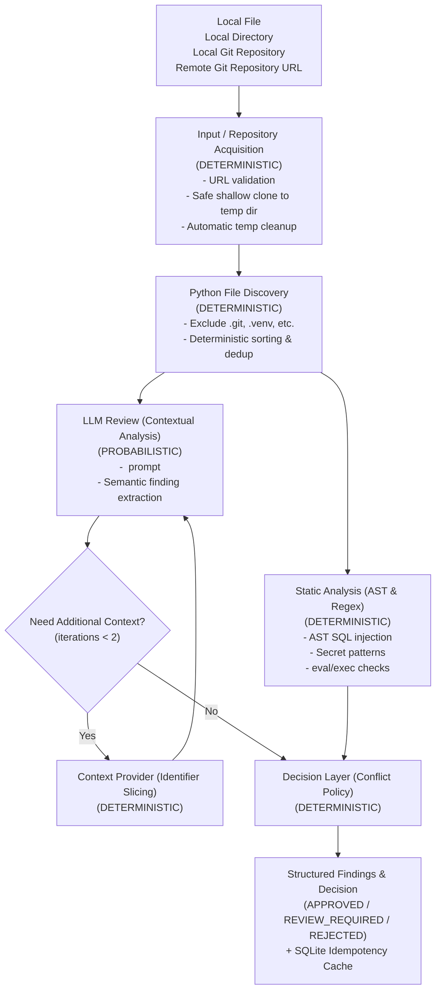

# Mini ReviewSentinel

A compact AI-assisted code review system built for the Technical Assignment. It evaluates Python code and returns one of `APPROVED`, `REVIEW_REQUIRED`, or `REJECTED`.

## Why this design

The assignment explicitly says deterministic checks must not rely entirely on an LLM, the LLM must not be the final authority, conflicting evidence must have a policy, and the agentic portion must revisit at least one finding with a bounded iteration count.

This implementation therefore uses a simple state machine instead of adding multiple agents purely for appearance.

## Architecture

### Visual Flow Diagram (Mermaid)



### Architecture Flow

```text
Local File
Local Directory
Local Git Repository
Remote Git Repository
        ↓
Input / Repository Acquisition
        ↓
Python File Discovery
        ↓
+-------------------------+
| Static Analysis         |
| LLM Review              |
+-------------------------+
        ↓
Agent / Context Loop
        ↓
Decision Layer
        ↓
Output
```

### Deterministic components

- Git repository acquisition flow (URL recognition, safe shallow cloning, and guaranteed temporary directory cleanup)
- Python file discovery (recursive walk excluding `.git`, `.venv`, `venv`, `__pycache__`, `.pytest_cache`, `build`, `dist` with deterministic ordering and duplicate prevention)
- AST analysis (Python AST syntax tree parsing, `eval()`/`exec()` call inspection, SQL interpolation sink detection)
- Decision policy (`resolve()` rule enforcing deterministic HIGH authority)
- Delimiter escaping for prompt-injection defense (`<UNTRUSTED_SOURCE>`)
- Bounded retry and termination state machine (`MAX_ITERATIONS = 2` with question deduplication)
- Caching (SQLite idempotency cache based on SHA-256 over repository-relative file paths and source bytes)
- LLM JSON schema extraction and validation

### Probabilistic component

- LLM contextual review: contextual code review and semantic reasoning via the Gemini adapter (`GeminiLLM`)

## Detection examples

Unsafe SQL:

```python
query = f"SELECT * FROM users WHERE id = {user_id}"
cursor.execute(query)
```

is high risk (`REJECTED`).

Parameter-interpolated SQL:

```python
query = "SELECT * FROM users WHERE id = %s" % user_id
cursor.execute(query)
```

is high risk (`REJECTED`).

Parameterized SQL:

```python
query = "SELECT * FROM users WHERE id = ?"
cursor.execute(query, (user_id,))
```

is safe and not reported as SQL injection.

## Conflict policy

1. **Deterministic `HIGH` risk is authoritative for `REJECTED`**: When AST or static regex finds a verifiable vulnerability, it cannot be overridden by an LLM reporting `LOW` risk.
2. **LLM `HIGH` risk with no deterministic high finding produces `REVIEW_REQUIRED`**: Contextual business-logic concerns spotted by the model are probabilistic, so they are escalated to human review rather than triggering automatic rejection.
3. **Any `MEDIUM` signal produces `REVIEW_REQUIRED`**.
4. **LLM unavailable fallback**: If the LLM times out or fails, review proceeds on deterministic evidence alone; approval is allowed only when deterministic analysis finds no medium or high issue.

## Agentic revisit

The LLM can return `needs_context=True` along with questions. The engine retrieves bounded code slices from the repository matching identifiers and sub-tokens, then invokes a second review cycle. `MAX_ITERATIONS = 2` and question deduplication prevent infinite loops.

## Prompt-injection defense

Reviewed source is treated strictly as untrusted data:
- Delimiters such as `</UNTRUSTED_SOURCE>` inside source code are escaped before embedding into prompts.
- The system prompt explicitly commands the model to ignore any instructions inside comments or docstrings.
- The deterministic decision layer enforces safety rules regardless of what the LLM outputs.

## Reliability

### LLM unavailable
The engine catches provider exceptions and timeouts, falling back to deterministic static analysis with an audit note.

### Malformed LLM output
`parse_llm_payload` robustly handles clean JSON, fenced codeblocks (````json ... ````), and payloads surrounded by explanatory conversational text, validating fields against the schema and raising safe errors on corrupt outputs.

### Analysis failure & encoding
Syntax errors and `UnicodeDecodeError` (non-UTF-8 / binary files) are caught and recorded as notes rather than crashing the pipeline.

### Repeated execution
All reviewed file contents and paths are hashed with SHA-256 into a 16-character `review_id` cached in SQLite. Repeated requests return cached results immediately without redundant LLM calls.

## Hidden Cases Considered (Section 10)

### Hidden Case 1: Safe object method calls named `.eval()` or `.execute()`
1. **Description**: Common libraries implement methods named `.eval()` (e.g. PyTorch `model.eval()`) or `.execute()` (e.g. background job runner `worker.execute()`).
2. **Naive failure mode**: Crude regex or substring matching flags any occurrence of `eval(` as dangerous arbitrary code execution and any `.execute(` as SQL injection.
3. **Our implementation**: AST analysis checks the node type: built-in `eval()` is an `ast.Name(id='eval')`, whereas method calls are `ast.Attribute(attr='eval')`. Non-SQL `.execute()` calls without dynamic SQL strings are safely ignored.
4. **Test**: `test_hidden_case_safe_object_methods_eval_execute` in [tests/test_review.py](file:///c:/Users/Nithin%20G%20J/Downloads/mini_review_sentinel/mini_review_sentinel/tests/test_review.py).

### Hidden Case 2: SQL injection via `%` modulo interpolation
1. **Description**: Queries constructed with Python `%` string formatting syntax before execution (e.g. `cursor.execute("SELECT * FROM users WHERE id = %s" % user_id)`).
2. **Naive failure mode**: Reviewers checking only f-strings or string concatenation (`+`) miss `ast.BinOp` with `ast.Mod`, allowing dangerous dynamic queries to pass undetected.
3. **Our implementation**: The AST visitor inspects `ast.BinOp` with `ast.Mod` specifically targeting SQL execution sinks while leaving normal arithmetic and logging formatting untouched.
4. **Test**: `test_sql_injection_mod_operator_detected` and `test_safe_non_sql_mod_operator` in [tests/test_review.py](file:///c:/Users/Nithin%20G%20J/Downloads/mini_review_sentinel/mini_review_sentinel/tests/test_review.py).

### Hidden Case 3: Environment variable lookups vs hard-coded secrets
1. **Description**: Code loading credentials securely via `os.environ.get("API_KEY")`, `os.getenv("SECRET_KEY")`, or `os.environ["DB_PASS"]`.
2. **Naive failure mode**: Secret scanners matching variable names like `api_key = ...` flag the lookup itself because the variable name resembles a credential key.
3. **Our implementation**: Regex pattern requires literal quoted string assignments with concrete length thresholds, preventing function calls or dictionary access from being falsely reported.
4. **Test**: `test_environment_variables_not_flagged_as_secrets` in [tests/test_review.py](file:///c:/Users/Nithin%20G%20J/Downloads/mini_review_sentinel/mini_review_sentinel/tests/test_review.py).

## Install

```bash
python -m venv .venv
# Windows: .venv\\Scripts\\activate
# macOS/Linux: source .venv/bin/activate
pip install -r requirements.txt
```

The tests only depend on Python and pytest. Gemini is optional.

## Run tests

```bash
pytest -q
```

## Run review

Without an LLM, deterministic analysis still works:

```bash
# Review a single Python file
python -m app.cli examples/payments.py

# Review a directory of Python files
python -m app.cli examples/

# Review the local repository
python -m app.cli .

# Review a remote Git repository (HTTPS)
python -m app.cli https://github.com/user/repository.git

# Review a remote Git repository (SSH)
python -m app.cli git@github.com:user/repository.git

# Review a specific branch or ref
python -m app.cli https://github.com/user/repository.git --ref main

# Output machine-readable JSON
python -m app.cli --json examples/payments.py
```

When a remote Git URL is provided, ReviewSentinel:
1. Validates the URL structure.
2. Clones the repository using a shallow clone (`--depth 1`) into an isolated temporary directory.
3. Automatically executes directory discovery and review against the cloned source files.
4. Reports findings with repository-relative paths (e.g. `src/auth.py:42`) without exposing internal temporary directories.
5. Guaranteed cleanup of the temporary clone after review finishes, including on error.

For Gemini, set:

```bash
set GOOGLE_API_KEY=...
```

or on macOS/Linux:

```bash
export GOOGLE_API_KEY=...
```

then run the same CLI command.

## Security Considerations

Treat remote repositories as **untrusted input**, just like the source code itself:

- **No Code Execution**: ReviewSentinel never executes repository code during acquisition, parsing, or review.
- **No Build or Dependencies**: It does not run `setup.py`, `Makefile`, shell scripts, `pip install`, package installations, or repository test suites.
- **Data Only**: Repository files remain strictly passive data parsed into AST syntax trees or inspected via regex patterns.
- **Controlled Acquisition**: The only external command executed is a controlled `git clone` command run with:
  - `core.hooksPath=""` (custom hooks disabled)
  - `GIT_TERMINAL_PROMPT=0` and `GCM_INTERACTIVE=never` (interactive prompt hangs disabled)
  - Filter processes disabled (`filter.lfs.process=`)
  - Submodules uninitialized by default
- **Prompt Injection Defense**: Source code passed to the LLM is delimited within `<UNTRUSTED_SOURCE>...</UNTRUSTED_SOURCE>` tags with escaped closing boundaries, instructing the model to treat all source code content as untrusted data rather than system instructions.
- **Temporary Cleanup**: Cloned repositories are held in temporary working directories with read-only permission overrides that guarantee removal even on failure.

## Example review

```text
Decision: REJECTED
Static risk: HIGH | LLM risk: LOW | Iterations: 1

payments.py:42

Finding: SQL Injection
Severity: HIGH

Evidence:
The SQL query is an f-string containing interpolated expressions before execute().

Recommendation:
Use a parameterized query with placeholders and pass user-controlled values separately.

Decision:
REJECTED
```

## Three representative test outputs

The test suite prints actual result dictionaries for three required cases. Run `pytest -q -s` to capture the exact output produced by this implementation:

- genuine SQL injection
- safe parameterized SQL
- hard-coded secret

## Known limitations

1. **Intra-File 1-Hop Dataflow**: Deterministic SQL injection analysis tracks variable assignments within the same file (1-hop assignment). It does not perform whole-program cross-module taint tracking (e.g., dynamic queries constructed in a separate utility module and imported).
2. **High-Confidence Secret Patterns**: Secret detection focuses on explicit token formats (AWS keys, high-entropy token assignments) and suppresses standard test placeholders; it does not scan git commit history or perform global Shannon entropy estimation.
3. **Local Context Bounds**: Agentic context retrieval extracts identifier-relevant slices from within the submitted review files; it is a bounded local slice retriever rather than a repository-wide vector embedding RAG engine.
4. **Python Language Scope**: The deterministic AST analyzer is specialized for Python syntax; non-Python files are passed to contextual analysis if submitted.
5. **Private Repository Authentication**: Non-interactive Git authentication is disabled by design to avoid blocking CLI executions; private repositories require pre-configured SSH keys or credentials in the environment.
6. **Git Metadata & Pull Requests**: ReviewSentinel reviews repository source code directly; it does not parse pull request diffs, Git blame, commit logs, or GitHub issue threads.

